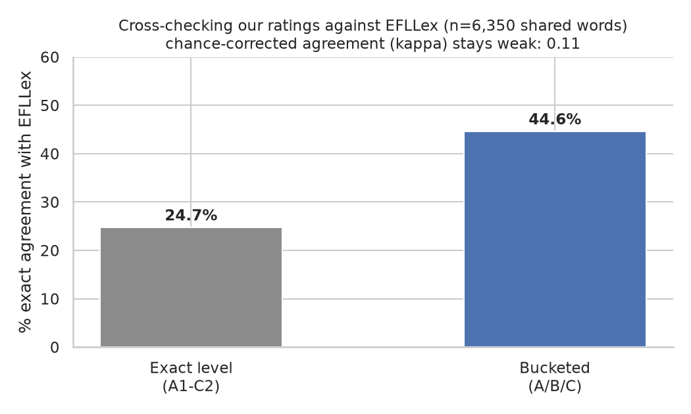
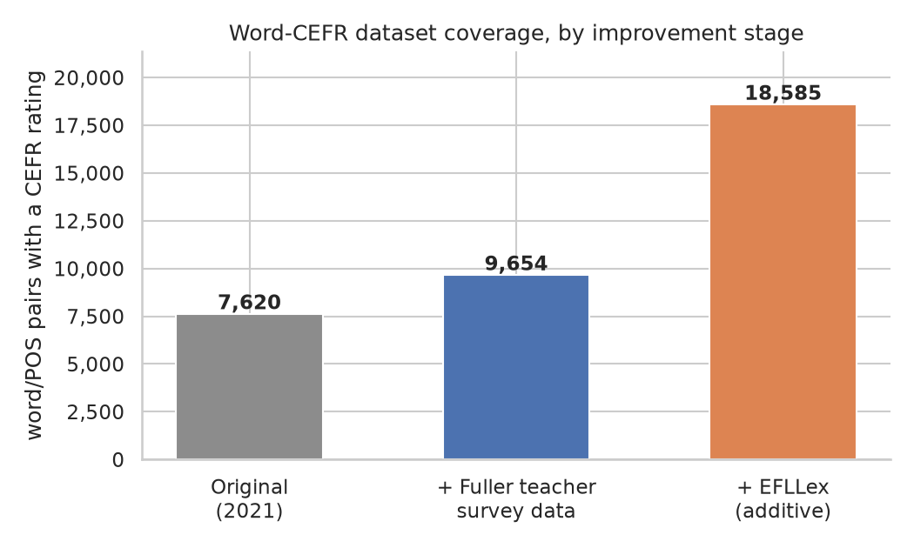

# Intelli-e-Reader

Intelli-e-Reader takes a PDF and rewrites it to be easier to read for an English learner, without dumbing down the story. It finds words that are above a target reading level and swaps them for simpler synonyms — but only when a synonym can be found that doesn't change what the sentence actually means. Upload a book, get back the same book with hard words highlighted; click a highlighted word to see the original and the alternatives that were considered.

Difficulty is measured against **CEFR** (the Common European Framework of Reference for Languages), the same A1–C2 scale used in language teaching. This project collapses it to three buckets — **A** (easy), **B** (medium), **C** (hard) — and only ever simplifies *toward* A.

This started as a 2021 project ([`Report/`](Report/) and [`notebook/Intelli_eReader.ipynb`](notebook/Intelli_eReader.ipynb) are the original writeup and prototype); this repo is a restructured, working version of it.

## Architecture

Two halves: a frontend you interact with, and a backend that does the actual language processing.

```
reader-ui/ (Angular)  --upload PDF-->  app.py (Flask)  -->  src/intelli_e_reader/reader/
     |                                                              |
     +-- highlighted book, click a word for details  <--------------+
                                                                      |
                                                        data/processed/ (word CEFR
                                                        ratings + synonym candidates)
```

- **[`reader-ui/`](reader-ui/)** — the Angular frontend. Upload a PDF, read the simplified result rendered like a book, click a highlighted word to see what it originally was and what other candidates were considered.
- **[`app.py`](app.py)** — the Flask API the frontend talks to. Takes the uploaded PDF, hands it to the pipeline below, returns the simplified text as JSON.
- **[`src/intelli_e_reader/reader/`](src/intelli_e_reader/reader/)** — the actual NLP pipeline:
  - `custom_reader.py` — orchestrates everything: extracts text from the PDF ([PyMuPDF](https://pymupdf.readthedocs.io/)), tags each word's part of speech ([NLTK](https://www.nltk.org/)), and for every word rated above CEFR level A, looks for a simpler replacement.
  - `cefr.py` — looks up a word's CEFR rating from a pre-built table (see **Data** below).
  - `syn_retriever.py` — finds candidate synonyms for a word from two independently-scraped sources.
  - `semantic_check.py` — scores how well each candidate preserves the original sentence's meaning, using a sentence-embedding model ([`sentence-transformers`](https://www.sbert.net/)) — so a replacement is only used if it's both simpler *and* still makes sense in context.

There's also a second, **separate and experimental** piece that is *not* part of the live pipeline above: [`src/intelli_e_reader/cefr_model/`](src/intelli_e_reader/cefr_model/) trains ML models (a Random Forest and a small neural network) to *predict* a word's CEFR level from its usage-frequency trend over time, as an alternative to the fixed lookup table. It was never wired into `reader/` — that always uses the lookup table — and its own dependencies haven't been verified on a modern Python yet (`pip install -e ".[training]"` if you want to try). In principle: `train.py` trains the Random Forest and neural network models and saves them under `models/cefr_prediction/`; `test.py` loads them to predict a given word/part-of-speech's CEFR level.

## Setup

**Prerequisites**: Python 3.11+ (tested on 3.12 and 3.14) and [`uv`](https://docs.astral.sh/uv/); Node.js if you also want the frontend (Angular 11 here — old enough that a modern Node can misbehave with its build tooling; Node 14 is what this was actually verified against).

### Backend

```
uv sync                                        # installs everything pinned in pyproject.toml
uv run python -c "import nltk; nltk.download('averaged_perceptron_tagger_eng'); nltk.download('stopwords')"
uv run python -m intelli_e_reader.data_utils   # builds data/processed/ from data/raw/ (see Data below)
uv run python app.py                           # starts the API on http://localhost:5001
```

(No `uv`? `pip install -e .` installs the same pinned dependencies from `pyproject.toml`, then drop the `uv run` prefix from the rest.)

Check it's up:
```
curl http://localhost:5001/
```

### Frontend

```
cd reader-ui
npm install
npm start          # or: ng serve
```
Open `http://localhost:4200`. It's already pointed at `http://localhost:5001` (see `reader-ui/src/environments/environment.ts`) — no config needed if you're running both locally.

Try it end-to-end by uploading `data/pdf/Treasure Island.pdf` (already in the repo) through the UI.

## Data

**`data/raw/`** — the original collected sources: two independent word-difficulty ratings (a scrape of the English Profile website, and a teacher survey), two independently-scraped synonym sources, a general ~370,000-word English vocabulary list, and **EFLLex** (a published academic CEFR lexicon, added later — see below). These are committed to the repo — they can't be easily reconstructed if the original scrapers or sources ever go away.

**`data/processed/`** — tables *derived* from `data/raw/`, built by [`src/intelli_e_reader/data_utils.py`](src/intelli_e_reader/data_utils.py). Most of these are **not committed** — they're cheap to regenerate, so they're left out of the repo rather than carried around as build output. Before running the app for the first time (or after pulling changes to `data/raw/`), run:

```
python -m intelli_e_reader.data_utils
```

This builds:
- `family2_word_synonyms.parquet` — one row per (word, part of speech): its CEFR rating plus its combined candidate synonyms (~18,600 words total — see below for where that number comes from). This is what `reader/cefr.py` and the live pipeline actually depend on.
- `family2_synonym_candidates_with_cefr.parquet` — candidate synonyms that themselves have a CEFR rating (not used by the live app; useful for analysis).
- `family3_vocabulary.parquet` — the full vocabulary with part-of-speech tags (feeds `cefr_model/`, not the live app).

Two further processed files *are* committed, since regenerating them is slow or depends on an external service: `all_english_words_tagged.csv` (re-tagging ~370,000 words) and `master_cefr_with_ngram.csv` (re-scraping Google's Ngram viewer for usage-frequency trends, via `src/intelli_e_reader/data_pipeline/generate_ngram_data_for_cefr_master.py` and `google_ngram_parser.py`). Both only feed the experimental `cefr_model/`, not the live app.

**[`notebook/Dataset-EDA.ipynb`](notebook/Dataset-EDA.ipynb)** is where this raw-to-processed logic was worked out and explored before being finalized into `data_utils.py` — it's for exploration only and doesn't save anything itself.

### Improving the word-CEFR dataset

The original dataset merged two sources — a scrape of Cambridge's [English Profile](https://www.englishprofile.org/) wordlist and a small teacher survey — with a simple rule: if both rated the same word, English Profile's rating won. That rule had never actually been checked against real numbers.

To sanity-check it, the ratings were cross-referenced against [EFLLex](https://cental.uclouvain.be/cefrlex/efllex/) (UCLouvain's CEFRLex project — an independently built, corpus-derived CEFR lexicon covering A1–C1). That turned up two real, previously-hidden problems:

- **Weak agreement with an independent source.** Even after coarsening both ratings down to easy/medium/hard, exact agreement with EFLLex was only 44.6% on the ~6,300 words both cover, and chance-corrected agreement (Cohen's kappa — a stricter measure that discounts however much two sources would coincidentally agree just by guessing) stayed weak at 0.11.

  

- **The merge itself was silently discarding most of the teacher survey.** Digging into why agreement was so weak led back to the merge: of the ~7,100 words both our own sources rated, they actually disagreed 72.8% of the time — and on every one of those, English Profile's rating silently won, not because it had been checked to be more reliable, but because the teacher-survey file being merged had already been rounded and filtered down from ~7,000 words to ~4,000 by a since-lost script, throwing away real signal. Switching to the fuller, unrounded per-teacher averages recovered that signal and added ~2,000 more rated words, while still keeping English Profile — the larger, professionally curated source — as the deciding vote on any real disagreement.

With both original sources on solid footing, EFLLex was then merged in a third time, purely **additively**: ~8,900 more words that neither original source rated at all, added without overriding a single existing rating.



Two honest gaps worth knowing about in the newly-added words: EFLLex has no C2 label at all (its source texts top out at C1), so these words can never be rated harder than C1; and none of them have synonym candidates yet, since the synonym scrapers were only ever run against the original ~7,600-word vocabulary.
