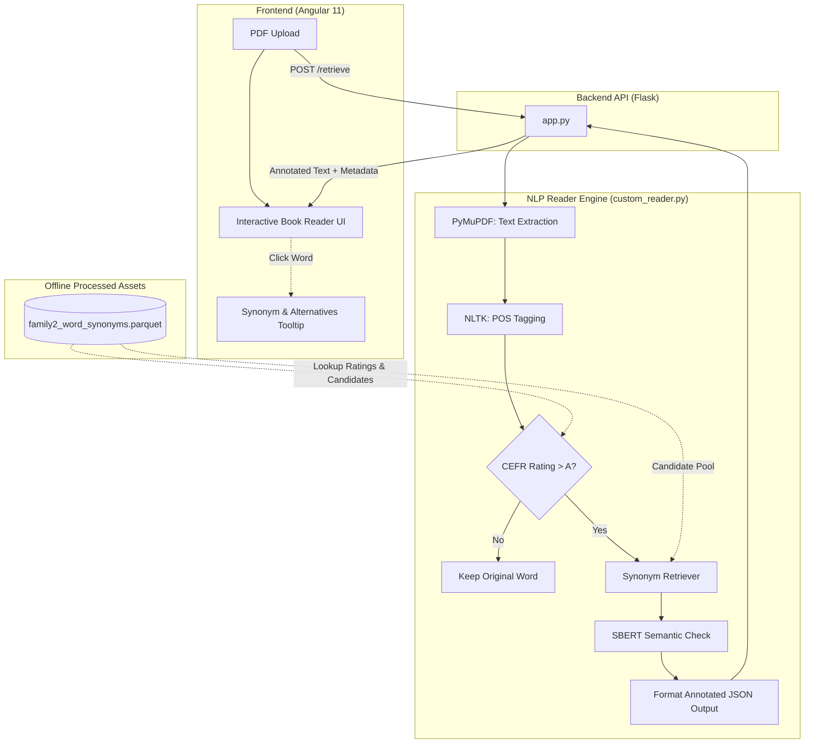
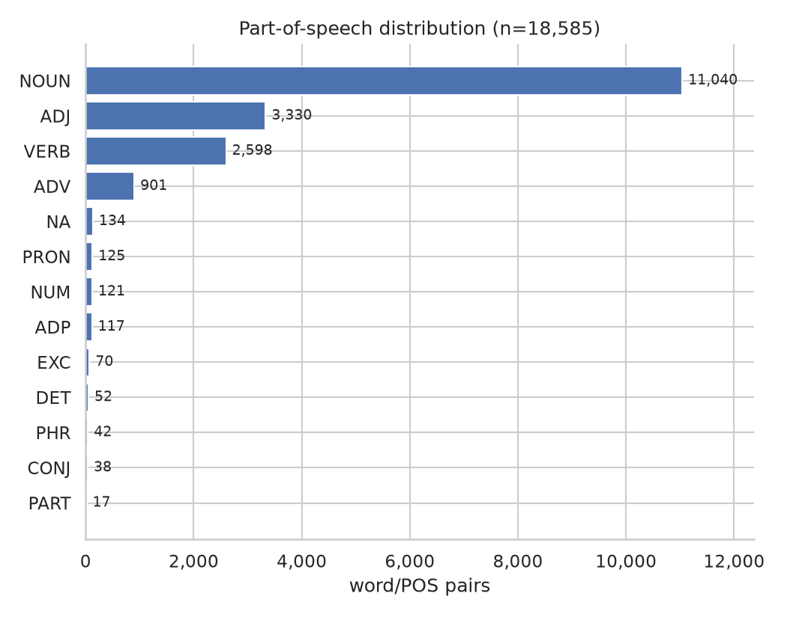
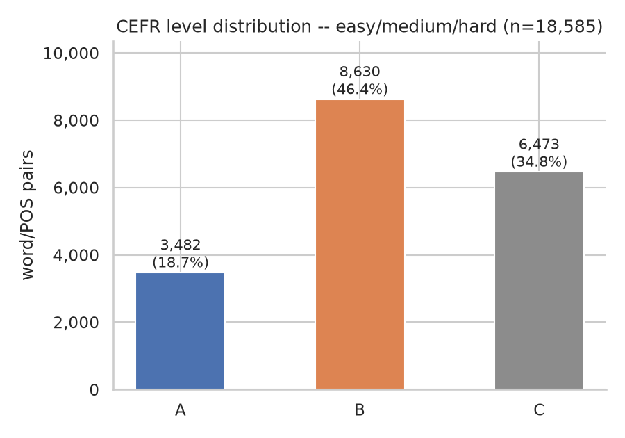
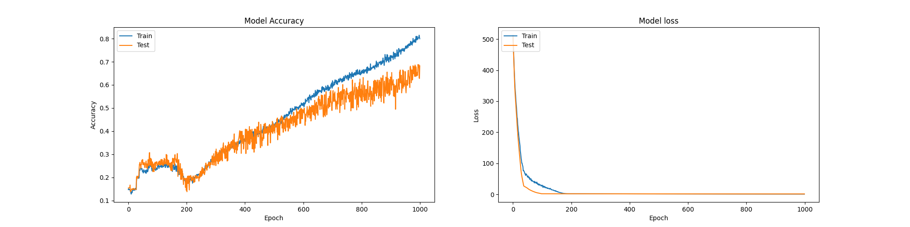
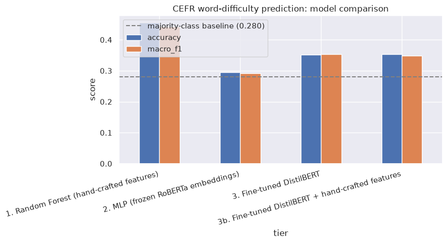
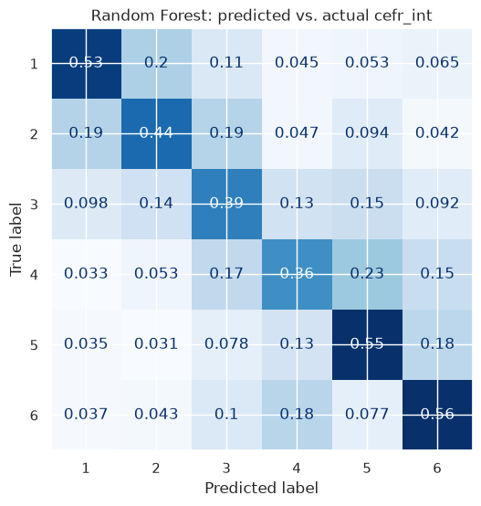

# Intelli-e-Reader


Intelli-e-Reader takes a PDF and rewrites it to be easier to read for an English learner, without dumbing down the story. It finds words that are above a target reading level and swaps them for simpler synonyms — but only when a synonym can be found that doesn't change what the sentence actually means. Upload a book, get back the same book with hard words highlighted; click a highlighted word to see the original and the alternatives that were considered.

Difficulty is measured against **CEFR** (the Common European Framework of Reference for Languages), the same A1–C2 scale used in language teaching. This project collapses it to three buckets — **A** (easy), **B** (medium), **C** (hard) — and only ever simplifies *toward* A.

This started as a 2021 project ([`Report/`](Report/) and [`notebook/Intelli_eReader.ipynb`](notebook/Intelli_eReader.ipynb) are the original writeup and prototype); this repo is a restructured, working version of it.

## Architecture

Two halves: a frontend you interact with, and a backend that does the actual language processing.



- **[`reader-ui/`](reader-ui/)** — the Angular frontend. Upload a PDF, read the simplified result rendered like a book, click a highlighted word to see what it originally was and what other candidates were considered.
- **[`app.py`](app.py)** — the Flask API the frontend talks to. Takes the uploaded PDF, hands it to the pipeline below, returns the simplified text as JSON.
- **[`src/intelli_e_reader/reader/`](src/intelli_e_reader/reader/)** — the actual NLP pipeline:
  - `custom_reader.py` — orchestrates everything: extracts text from the PDF ([PyMuPDF](https://pymupdf.readthedocs.io/)), tags each word's part of speech ([NLTK](https://www.nltk.org/)), and for every word rated above CEFR level A, looks for a simpler replacement.
  - `cefr.py` — looks up a word's CEFR rating from a pre-built table (see **Data** below).
  - `syn_retriever.py` — finds candidate synonyms for a word from two independently-scraped sources.
  - `semantic_check.py` — scores how well each candidate preserves the original sentence's meaning, using a sentence-embedding model ([`sentence-transformers`](https://www.sbert.net/)) — so a replacement is only used if it's both simpler *and* still makes sense in context.

There's also a second, **separate and experimental** piece that is *not* part of the live pipeline above: [`src/intelli_e_reader/cefr_model/`](src/intelli_e_reader/cefr_model/) trains ML models to *predict* a word's CEFR level, as an alternative to the fixed lookup table. It was never wired into `reader/` — that always uses the lookup table. See **[CEFR-Prediction Model](#cefr-prediction-model)** below for what it actually does now and how the four approaches compare.

## Setup

**Prerequisites**: Python 3.11+ (tested on 3.12 and 3.14) and [`uv`](https://docs.astral.sh/uv/); Node.js if you also want the frontend (Angular 11 here — old enough that a modern Node can misbehave with its build tooling; Node 14 is what this was actually verified against).

### Backend

```
uv sync                                        # installs everything pinned in pyproject.toml
uv run python -c "import nltk; nltk.download('averaged_perceptron_tagger_eng'); nltk.download('stopwords')"
uv run python -m intelli_e_reader.data_utils   # builds data/processed/ from data/raw/ (see Data below)
uv run python app.py                           # starts the API on http://localhost:5001
```

(No `uv`? `pip install -e .` installs the same pinned dependencies from `pyproject.toml`, then drop the `uv run` prefix from the rest.)

Check it's up:
```
curl http://localhost:5001/
```

### Frontend

```
cd reader-ui
npm install
npm start          # or: ng serve
```
Open `http://localhost:4200`. It's already pointed at `http://localhost:5001` (see `reader-ui/src/environments/environment.ts`) — no config needed if you're running both locally.

Try it end-to-end by uploading `data/pdf/Treasure Island.pdf` (already in the repo) through the UI.

## Data

**`data/raw/`** — the original collected sources: two independent word-difficulty ratings (a scrape of the English Profile website, and a teacher survey), two independently-scraped synonym sources, a general ~370,000-word English vocabulary list, and **EFLLex** (a published academic CEFR lexicon, added later — see below). These are committed to the repo — they can't be easily reconstructed if the original scrapers or sources ever go away.

**`data/processed/`** — tables *derived* from `data/raw/`, built by [`src/intelli_e_reader/data_utils.py`](src/intelli_e_reader/data_utils.py). Most of these are **not committed** — they're cheap to regenerate, so they're left out of the repo rather than carried around as build output. Before running the app for the first time (or after pulling changes to `data/raw/`), run:

```
python -m intelli_e_reader.data_utils
```

This builds:
- `family2_word_synonyms.parquet` — one row per (word, part of speech): its CEFR rating plus its combined candidate synonyms (~18,600 words total — see below for where that number comes from). This is what `reader/cefr.py` and the live pipeline actually depend on.
- `family2_synonym_candidates_with_cefr.parquet` — candidate synonyms that themselves have a CEFR rating (not used by the live app; useful for analysis).
- `family3_vocabulary.parquet` — the full vocabulary with part-of-speech tags (feeds `cefr_model/`, not the live app).

Two further processed files *are* committed, since regenerating them is slow or depends on an external service: `all_english_words_tagged.csv` (re-tagging ~370,000 words) and `master_cefr_with_ngram.csv` (re-scraping Google's Ngram viewer for usage-frequency trends, via `src/intelli_e_reader/data_pipeline/generate_ngram_data_for_cefr_master.py` and `google_ngram_parser.py`). Both only feed the experimental `cefr_model/`, not the live app.

**[`notebook/Dataset-EDA.ipynb`](notebook/Dataset-EDA.ipynb)** is where this raw-to-processed logic was worked out and explored before being finalized into `data_utils.py` — it's for exploration only and doesn't save anything itself.

### Improving the word-CEFR dataset

The original dataset merged two sources — a scrape of Cambridge's [English Profile](https://www.englishprofile.org/) wordlist and a small teacher survey — with a simple rule: if both rated the same word, English Profile's rating won. That rule had never actually been checked against real numbers.

To sanity-check it, the ratings were cross-referenced against [EFLLex](https://cental.uclouvain.be/cefrlex/efllex/) (UCLouvain's CEFRLex project — an independently built, corpus-derived CEFR lexicon covering A1–C1). That turned up two real, previously-hidden problems:

- **Weak agreement with an independent source.** Even after coarsening both ratings down to easy/medium/hard, exact agreement with EFLLex was only 44.6% on the ~6,300 words both cover, and chance-corrected agreement (Cohen's kappa — a stricter measure that discounts however much two sources would coincidentally agree just by guessing) stayed weak at 0.11.

  

- **The merge itself was silently discarding most of the teacher survey.** Digging into why agreement was so weak led back to the merge: of the ~7,100 words both our own sources rated, they actually disagreed 72.8% of the time — and on every one of those, English Profile's rating silently won, not because it had been checked to be more reliable, but because the teacher-survey file being merged had already been rounded and filtered down from ~7,000 words to ~4,000 by a since-lost script, throwing away real signal. Switching to the fuller, unrounded per-teacher averages recovered that signal and added ~2,000 more rated words, while still keeping English Profile — the larger, professionally curated source — as the deciding vote on any real disagreement.

With both original sources on solid footing, EFLLex was then merged in a third time, purely **additively**: ~8,900 more words that neither original source rated at all, added without overriding a single existing rating.


Two honest gaps worth knowing about in the newly-added words: EFLLex has no C2 label at all (its source texts top out at C1), so these words can never be rated harder than C1; and none of them have synonym candidates yet, since the synonym scrapers were only ever run against the original ~7,600-word vocabulary.

### The final word→CEFR dataset

After all three merges, this is the word→CEFR table (`word`, `pos`, `cefr`) any future CEFR-prediction model would train on — the same 18,585 rows as `family2_word_synonyms.parquet`, just without its `synonym_list` column, which isn't a training feature (synonyms are looked up *after* a word's CEFR level is already known, not used to predict it).




Both distributions are skewed — `NOUN` alone is 59% of the data, and `B` (medium) outnumbers `A` (easy) more than 2:1. Neither needs fixing in the data itself: POS here is a model *feature*, not the prediction target, so a rare tag just carries a little less signal rather than being "unlearnable"; and the CEFR skew, while real, is moderate enough (~4:1 largest-to-smallest) to handle with class weights at training time rather than needing oversampling or dropped categories.

## CEFR-Prediction Model

The live app never runs a model — it looks up a word's CEFR level straight from the table above. `src/intelli_e_reader/cefr_model/` is a separate, offline question: now that the dataset has real, cross-checked labels, can a model predict a word's CEFR level well enough to be useful — say, for rating words the lookup table doesn't cover?

The 2021 report describes training a Random Forest, a neural network, and an SVM and averaging their outputs, but never reports an accuracy, F1, or any other metric for any of them. The trained artifacts from that run don't offer a real baseline either, and have since been removed from this repo: the `.pkl` no longer unpickled at all under a modern sklearn (its internal tree format has changed since 2021), and even loadable, the pipeline that produced it stacked three models by feeding one stage's predictions — computed over the *entire* dataset — as input features into the next stage's *fresh* train/test split, so a row could be in one stage's training set and the next stage's "test" set after its true label had already leaked in through that meta-feature. Its own training curve confirms the signature of this:



Train accuracy near 80% against a test accuracy trailing at 65–68% and still diverging at epoch 1000 of 1000. So there's no real 2021 baseline to hold this up against; the numbers below are the first time this task has actually been evaluated in a way that can be trusted.

**[`notebook/CEFR-Model-Training.ipynb`](notebook/CEFR-Model-Training.ipynb)** builds and compares four approaches on the same stratified 80/20 split, the same class weighting, and the same evaluation metrics — accuracy, macro F1, and mean absolute error treating `cefr_int` as ordinal (an off-by-one mistake costs less than an off-by-four):

| Tier | Approach | accuracy | macro F1 | MAE |
|---|---|---|---|---|
| 1 | Random Forest on hand-crafted psycholinguistic features (age-of-acquisition, concreteness, frequency, polysemy, etymology) | **0.455** | **0.442** | **0.907** |
| 2 | MLP on frozen `roberta-base-nli-stsb-mean-tokens` sentence embeddings (the same model `semantic_check.py` uses live) | 0.295 | 0.292 | 1.220 |
| 3 | Fine-tuned DistilBERT — weights unfrozen, trained end-to-end on the labels | 0.352 | 0.354 | 1.019 |
| 3b | Fine-tuned DistilBERT + Tier 1's hand-crafted features, concatenated before the classification head | 0.354 | 0.349 | 0.995 |

*(majority-class baseline: 0.280 accuracy; random baseline: 0.167)*



**Random Forest wins outright, and it isn't close.** Two reasons, both visible during training: DistilBERT (~67M parameters) overfits hard on ~15k training words — training loss keeps falling while test loss climbs within a handful of epochs — whereas Random Forest's capacity is a much better match for a dataset this size. And CEFR levels are themselves built from corpus frequency and usage data, so age-of-acquisition, concreteness, and frequency are close to a direct measurement of what's being predicted; a transformer has to infer something adjacent to that from a bare word's spelling alone, with no sentence for context. Concatenating both signals (3b) barely helped over Tier 3 alone — the transformer branch's much larger capacity keeps overfitting before the 34 clean hand-crafted features get much say in the final prediction.



Errors are mostly one level off the diagonal, not scattered across the whole scale — consistent with the dataset's own label noise (see the EFLLex cross-check above) rather than the model getting things randomly wrong.

### Zero-shot LLM baseline

Alongside the four trained tiers, [`notebook/GeminiBatch-Inference-Test.ipynb`](notebook/GeminiBatch-Inference-Test.ipynb) asks Gemini 3.6 Flash to rate every one of the 18,585 (word, POS) pairs directly, with no training at all — an independent reference point, not a fifth tier competing on identical terms (see the caveat below).

**Prompting** ([`prompts/cefr_classification/`](prompts/cefr_classification/)): a deliberately compact system prompt — a modern LLM already knows the CEFR framework, so a long rubric mostly costs tokens without adding signal — plus 3 few-shot examples spanning A1/B1/C1, each picked from a word where English Profile and EFLLex *independently agree* on the exact level, not hand-picked from intuition. The examples are structured as real alternating user/model turns rather than a text blob, and output is constrained with a JSON response schema (`cefr_int`, `cefr_level`, `confidence`, `reasoning`) so responses need no re-parsing.

**Inference** ([`src/intelli_e_reader/llm_baseline.py`](src/intelli_e_reader/llm_baseline.py)): the Batch API rather than per-word synchronous calls — cheaper, and built to run unattended over ~18.6k words. Getting there took a few real fixes: the correct wire format for a hand-authored batch JSONL request (traced from the installed SDK's own request-building code after a first guess was rejected with `400 INVALID_ARGUMENT`), retry-with-backoff on transient `429`/`503` errors, and chunking into 7 files of 3,000 rows each for resumable, independently-trackable submission. A synchronous fallback (`run_concurrent_inference`) exists for accounts without batch access, with the same resumability — already-completed rows are read back from disk and skipped, so an interrupted run never re-asks (or re-bills) an already-answered word.

**Result**, on all 18,571 words that returned a valid prediction:

| Metric | Value |
|---|---|
| Exact match, coarse A/B/C | 52.1% |
| Exact match, full 6-point `cefr_int` | 33.2% |
| MAE (ordinal) | 1.021 |
| Within 1 CEFR level | 74.9% |

On the 6-point scale, that MAE (1.021) lands right next to Tier 3's fine-tuned DistilBERT (1.019), and its exact-match accuracy (33.2%) sits between Tier 2 (29.5%) and Tier 3/3b (35.2%/35.4%) — a zero-shot call with no training at all performs competitively with a small transformer that spent 10+ epochs training directly on this data. Confidence is reasonably well-calibrated too: agreement is highest when the model reports "high" confidence (53.8%) and lowest at "low" confidence (39.2%).

**One honest caveat**: this isn't a fully apples-to-apples fifth tier. The four trained tiers are scored only on their held-out 20% test split; Gemini is scored against the *entire* dataset, since it never trained on any of it — a ~5x larger comparison set, evaluated the same way, but not literally the same rows.

It's also worth re-reading the coarse 52.1% number against the EFLLex cross-check earlier in this README: two independently-curated human sources (English Profile and EFLLex) agreed with each other only 44.6% of the time on the words both cover. A model that's never seen this dataset agreeing with it *more* than two human sources agreed with each other is a strong sign that a meaningful chunk of the remaining error — for the LLM and the trained tiers alike — is real disagreement baked into the labels, not purely a modeling gap still waiting to be closed.

Token cost was tracked but not priced: a 5-word sample averaged ~461 tokens/word (prompt + output), projecting to ~8.6M tokens for the full 18,585-word vocabulary. Check Google AI Studio's current batch-tier pricing before assuming a specific dollar figure — it wasn't hardcoded here since it changes independently of this repo.

### In short

Four architectures plus one zero-shot baseline, all on the same data, the same split, the same metrics: **hand-crafted domain features beat every neural approach tried**, including a transformer fine-tuned with direct access to those same features. Bigger and more "modern" wasn't better here — a 67M-parameter model overfit a 15k-row dataset that a few hundred shallow trees handled comfortably. And a zero-shot LLM that never saw this dataset at all landed competitively with the best neural tier anyway, which points at *why*: CEFR level is close to a direct function of frequency and age-of-acquisition, which the hand-crafted features measure explicitly and everything else has to infer indirectly — and a real chunk of whatever's left unexplained is disagreement already baked into the labels (see the EFLLex cross-check), not a gap more model capacity would close. **Random Forest wins, clearly enough that it's the one candidate worth carrying forward** 

All four trained runs — Random Forest and all three neural variants, with their hyperparameters, per-epoch metrics, and artifacts — are logged in MLflow:
```
.venv/bin/mlflow ui --backend-store-uri sqlite:///mlflow.db
```

